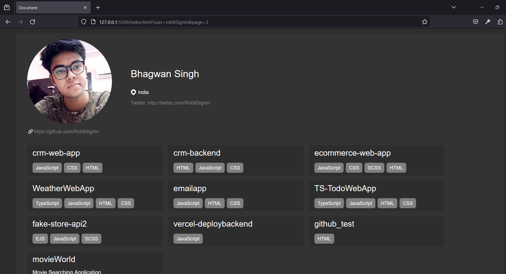

# GitHub Repositories Listing Page Documentation

## Introduction

Welcome to the documentation for the GitHub Repositories Listing Page! This web application allows users to view public repositories belonging to a specific GitHub user. It utilizes the GitHub REST API to fetch user details and repositories.

## Table of Contents

1. [Getting Started](#getting-started)
   - [Prerequisites](#prerequisites)
   - [Installation](#installation)
2. [Usage](#usage)
   - [URL Structure](#url-structure)
   - [Query Parameters](#query-parameters)
   - [Pagination](#pagination)
   - [Loader](#loader)
   - [Search Bar (Optional)](#search-bar-optional)
3. [API Endpoints](#api-endpoints)
   - [User Details](#user-details)
   - [Repositories](#repositories)
4. [Screenshots](#screenshots)

## Getting Started

### Prerequisites

To run this project, you need:

- Web browser (e.g., Chrome, Firefox)
- Internet connection

### Installation

No installation is required as it is a web-based application. Simply access the provided URL to use the GitHub Repositories Listing Page.

## Usage

### URL Structure

The URL structure for accessing the GitHub Repositories Listing Page is as follows:

### Query Parameters

- `user`: GitHub username (required)
- `page`: Page number for pagination (default: 1)
- `per_page`: Number of repositories per page (default: 10, maximum: 100)

### Pagination

Server-side pagination is implemented to improve performance. Users can navigate through pages by changing the `page` query parameter in the URL OR by pagination UI.

### Loader

Loaders are displayed while API calls are in progress, providing visual feedback to users.

## API Endpoints

### User Details

- **Endpoint**: `https://api.github.com/users/{username}`
- **Description**: Fetches details for the specified GitHub user.

### Repositories

- **Endpoint**: `https://api.github.com/users/{username}/repos?page={page}&per_page={per_page}`
- **Description**: Fetches public repositories for the specified GitHub user, with support for pagination.

## Screenshots

Include screenshots or GIFs demonstrating the functionality and appearance of the GitHub Repositories Listing Page.
